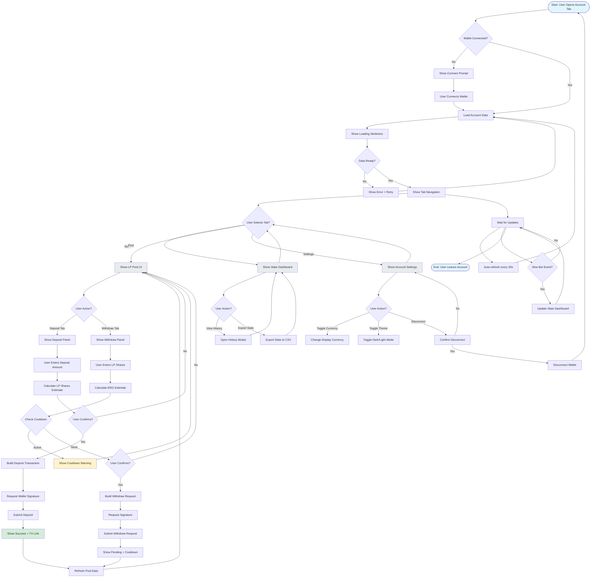

# Account Pages Interaction Flow

## Flow Overview

The account pages flow enables users to manage their wallet connection, view statistics, and interact with the liquidity pool (LP) for earning passive income.

## Mermaid Flow Diagram



## Screen-by-Screen Wireframes

### Screen 1: Initial State (Disconnected)

```
┌─────────────────────────────────────────────────────────────┐
│  Account                      [Games]  [Pool]  [Settings]   │
├─────────────────────────────────────────────────────────────┤
│                                                             │
│  ┌─────────────────────────────────────────────────────┐   │
│  │                                                     │   │
│  │               Connect Your Wallet                   │   │
│  │                                                     │   │
│  │   To view your account statistics and manage       │   │
│  │   your liquidity pool position, connect your       │   │
│  │   Ergo wallet.                                      │   │
│  │                                                     │   │
│  │                                                     │   │
│  │              [  Connect Wallet  ]                    │   │
│  │                                                     │   │
│  └─────────────────────────────────────────────────────┘   │
│                                                             │
│  Supported wallets: Nautilus, Saffron, Minotaur            │
└─────────────────────────────────────────────────────────────┘
```

### Screen 2: Stats Dashboard (Connected)

```
┌─────────────────────────────────────────────────────────────┐
│  Account                      [Games]  [Pool]  [Settings]   │
├─────────────────────────────────────────────────────────────┤
│  Wallet: 0x7a3f...8d2e                     [Disconnect]    │
│  Balance: 24.5 ERG                                         │
│                                                             │
│  ┌─────────────────────────────────────────────────────┐   │
│  │  📊 Your Statistics                                 │   │
│  ├─────────────────────────────────────────────────────┤   │
│  │                                                     │   │
│  │  ┌─────────┐  ┌─────────┐  ┌─────────┐  ┌─────────┐ │   │
│  │  │ Total   │  │  Wins   │  │ Losses  │  │ Pending │ │   │
│  │  │  Bets   │  │         │  │         │  │         │ │   │
│  │  │  127    │  │   64    │  │   59    │  │    4    │ │   │
│  │  └─────────┘  └─────────┘  └─────────┘  └─────────┘ │   │
│  │                                                     │   │
│  │  ┌─────────┐  ┌─────────┐                           │   │
│  │  │ Total   │  │  Net    │                           │   │
│  │  │ Wagered │  │  P&L    │                           │   │
│  │  │124.5 ERG│  │ +2.3 ERG│                           │   │
│  │  └─────────┘  └─────────┘                           │   │
│  │                                                     │   │
│  │  Win Rate: 50.4%                                     │   │
│  │  ████████████████████████████████░░░░░░░░            │   │
│  │                                                     │   │
│  │  Streaks: Current: 2W | Best: 8W | Worst: 5L        │   │
│  │                                                     │   │
│  │  [View History]  [Export Stats]  [Refresh]        │   │
│  └─────────────────────────────────────────────────────┘   │
│                                                             │
│  Last updated: Mar 28, 2026 01:15:32 UTC                    │
└─────────────────────────────────────────────────────────────┘
```

### Screen 3: Liquidity Pool (Deposit Tab)

```
┌─────────────────────────────────────────────────────────────┐
│  Account                      [Games]  [Pool]  [Settings]   │
├─────────────────────────────────────────────────────────────┤
│  Wallet: 0x7a3f...8d2e                     [Disconnect]    │
│  Balance: 24.5 ERG                                         │
│                                                             │
│  ┌─────────────────────────────────────────────────────┐   │
│  │  💎 Liquidity Pool                                   │   │
│  ├─────────────────────────────────────────────────────┤   │
│  │                                                     │   │
│  │  Pool Stats:                                         │   │
│  │  ┌─────────┐  ┌─────────┐  ┌─────────┐             │   │
│  │  │  TVL    │  │   APY   │  │  Price  │             │   │
│  │  │12,450 ERG│  │  15.2%  │  │ 1.0000  │             │   │
│  │  └─────────┘  └─────────┘  └─────────┘             │   │
│  │                                                     │   │
│  │  Your Position: 0 LP shares (0% of pool)           │   │
│  │  Your Earnings: 0 ERG                                │   │
│  │                                                     │   │
│  └─────────────────────────────────────────────────────┘   │
│                                                             │
│  ┌─────────────────────────────────────────────────────┐   │
│  │  [Deposit]  [Withdraw]                              │   │
│  └─────────────────────────────────────────────────────┘   │
│                                                             │
│  ┌─────────────────────────────────────────────────────┐   │
│  │  Deposit Amount (ERG)                                │   │
│  │  ┌───────────────────────────────────────────────┐  │   │
│  │  │ 10.0                             [MAX] [ ERG] │  │   │
│  │  └───────────────────────────────────────────────┘  │   │
│  │                                                     │   │
│  │  Estimated LP Shares: 10,000,000                   │   │
│  │  Price per share: 1.0000 ERG                       │   │
│  │                                                     │   │
│  │  [  Deposit ERG  ]                                 │   │
│  └─────────────────────────────────────────────────────┘   │
│                                                             │
│  ⚠️ Risk Notice: LPs can lose ERG if players go on winning │
│  streaks. Only deposit what you can afford to lose.        │
└─────────────────────────────────────────────────────────────┘
```

### Screen 4: Liquidity Pool (Withdraw Tab)

```
┌─────────────────────────────────────────────────────────────┐
│  Account                      [Games]  [Pool]  [Settings]   │
├─────────────────────────────────────────────────────────────┤
│  Wallet: 0x7a3f...8d2e                     [Disconnect]    │
│  Balance: 24.5 ERG                                         │
│                                                             │
│  ┌─────────────────────────────────────────────────────┐   │
│  │  💎 Liquidity Pool                                   │   │
│  ├─────────────────────────────────────────────────────┤   │
│  │                                                     │   │
│  │  Pool Stats:                                         │   │
│  │  ┌─────────┐  ┌─────────┐  ┌─────────┐             │   │
│  │  │  TVL    │  │   APY   │  │  Price  │             │   │
│  │  │12,450 ERG│  │  15.2%  │  │ 1.0000  │             │   │
│  │  └─────────┘  └─────────┘  └─────────┘             │   │
│  │                                                     │   │
│  │  Your Position: 1,000,000 LP shares (8% of pool)   │   │
│  │  Your Earnings: +45.3 ERG                           │   │
│  │                                                     │   │
│  └─────────────────────────────────────────────────────┘   │
│                                                             │
│  ┌─────────────────────────────────────────────────────┐   │
│  │  [Deposit]  [Withdraw]                              │   │
│  └─────────────────────────────────────────────────────┘   │
│                                                             │
│  ┌─────────────────────────────────────────────────────┐   │
│  │  LP Shares to Withdraw                              │   │
│  │  ┌───────────────────────────────────────────────┐  │   │
│  │  │ 500,000                          [MAX]         │  │   │
│  │  └───────────────────────────────────────────────┘  │   │
│  │                                                     │   │
│  │  Estimated ERG: 500 ERG                             │   │
│  │  Price per share: 1.0000 ERG                       │   │
│  │  Cooldown: None (ready to withdraw)                │   │
│  │                                                     │   │
│  │  [  Request Withdrawal  ]                          │   │
│  └─────────────────────────────────────────────────────┘   │
│                                                             │
│  ⚠️ Risk Notice: LPs can lose ERG if players go on winning │
│  streaks. Only deposit what you can afford to lose.        │
└─────────────────────────────────────────────────────────────┘
```

### Screen 5: Settings

```
┌─────────────────────────────────────────────────────────────┐
│  Account                      [Games]  [Pool]  [Settings]  │
├─────────────────────────────────────────────────────────────┤
│  Wallet: 0x7a3f...8d2e                     [Disconnect]    │
│  Balance: 24.5 ERG                                         │
│                                                             │
│  ┌─────────────────────────────────────────────────────┐   │
│  │  ⚙️ Account Settings                                │   │
│  ├─────────────────────────────────────────────────────┤   │
│  │                                                     │   │
│  │  Appearance                                         │   │
│  │  ┌─────────────────────────────────────────────┐   │   │
│  │  │ Theme:  [○ Light]  [● Dark]  [○ Auto]     │   │   │
│  │  └─────────────────────────────────────────────┘   │   │
│  │                                                     │   │
│  │  Display                                            │   │
│  │  ┌─────────────────────────────────────────────┐   │   │
│  │  │ Currency: [ERG ▼]                           │   │   │
│  │  │ Compact Mode: [○ Off]  [● On]              │   │   │
│  │  └─────────────────────────────────────────────┘   │   │
│  │                                                     │   │
│  │  Privacy                                            │   │
│  │  ┌─────────────────────────────────────────────┐   │   │
│  │  │ Show Balance:  [● Public]  [○ Hidden]       │   │   │
│  │  │ Show Stats:    [● Public]  [○ Hidden]       │   │   │
│  │  └─────────────────────────────────────────────┘   │   │
│  │                                                     │   │
│  │  Notifications                                      │   │
│  │  ┌─────────────────────────────────────────────┐   │   │
│  │  │ Bet Results:   [● On]  [○ Off]             │   │   │
│  │  │ LP Rewards:     [● On]  [○ Off]             │   │   │
│  │  │ Price Alerts:   [○ On]  [● Off]             │   │
│  │  └─────────────────────────────────────────────┘   │   │
│  │                                                     │   │
│  │  [  Save Settings  ]                                │   │
│  └─────────────────────────────────────────────────────┘   │
│                                                             │
│  Wallet ID: 0x7a3f9c8d2e5f4a6b7c8d9e0f1a2b3c4d5e6f7a8b   │
│  Connected since: Mar 27, 2026 15:30:00 UTC                │
└─────────────────────────────────────────────────────────────┘
```

### Screen 6: Deposit Success

```
┌─────────────────────────────────────────────────────────────┐
│                                                           × │
│  ┌─────────────────────────────────────────────────────┐   │
│  │  ✅ Deposit Successful!                             │   │
│  ├─────────────────────────────────────────────────────┤   │
│  │                                                     │   │
│  │  You deposited 10.0 ERG into the pool.             │   │
│  │                                                     │   │
│  │  Your LP Shares: 10,000,000                         │   │
│  │  Pool Share: 0.08%                                   │   │
│  │  Estimated Daily Yield: ~5.2 ERG                     │   │
│  │                                                     │   │
│  │  ─────────────────────────────────────────────────  │   │
│  │                                                     │   │
│  │  Transaction ID:                                    │   │
│  │  1a2b3c4d-5e6f-7890-abcd-ef1234567890              │   │
│  │                                                     │   │
│  │  [View on Explorer]  [Copy TX ID]                   │   │
│  │                                                     │   │
│  │                     [  Close  ]                     │   │
│  │                                                     │   │
│  └─────────────────────────────────────────────────────┘   │
│                                                             │
└─────────────────────────────────────────────────────────────┘
```

## Interaction States

### Tab States

| Tab | Active Visual | Hover Visual |
|-----|---------------|--------------|
| Games | Blue underline, bold text | Gray underline |
| Pool | Blue underline, bold text | Gray underline |
| Settings | Blue underline, bold text | Gray underline |

### Input States

| State | Visual | Behavior |
|-------|--------|----------|
| Empty | Gray placeholder | No validation |
| Invalid | Red border + error | Show error text |
| Valid | Green border (optional) | Calculate estimate |
| Max Selected | "MAX" highlighted | Show full amount |

### Button States

| State | Visual | Trigger |
|-------|--------|---------|
| Disabled | Gray, low opacity | Insufficient balance |
| Enabled | Green, prominent | Valid input |
| Loading | Spinner + "Processing..." | Transaction in progress |
| Success | Green checkmark | Operation completed |

## Pool Interaction Patterns

### Deposit Flow
1. User selects Deposit tab
2. Enters amount (or clicks MAX)
3. System calculates LP shares estimate
4. User confirms
5. System builds transaction
6. User signs with wallet
7. Transaction submitted
8. Pool data refreshed

### Withdraw Flow
1. User selects Withdraw tab
2. Enters LP shares (or clicks MAX)
3. System checks cooldown status
4. If active, show warning + countdown
5. If inactive, show ERG estimate
6. User confirms
7. System creates withdrawal request
8. User signs with wallet
9. Request submitted (cooldown starts)
10. Pool data refreshed

### Cooldown Handling

| State | Visual | User Action |
|-------|--------|-------------|
| None | "Ready to withdraw" | Can withdraw immediately |
| Active | "Cooldown: 2h 15m remaining" | Cannot withdraw |
| Expiring | "Cooldown: 5m remaining" | Button enables soon |

## Statistics Visualization

### Win Rate Bar
- Progress bar from 0-100%
- Color coded: > 50% green, < 50% red, = 50% gray
- Show exact percentage to right

### P&L Display
- Positive: Green with "+" prefix (e.g., "+2.3 ERG")
- Negative: Red with "-" prefix (e.g., "-5.0 ERG")
- Zero: Gray (e.g., "0.0 ERG")

### Streak Display
- Current: "3W" (3 wins) or "2L" (2 losses)
- Best: "8W" (8 wins)
- Worst: "5L" (5 losses)

## Settings Options

### Theme Options
- Light: Light background, dark text
- Dark: Dark background, light text
- Auto: Follows system preference

### Compact Mode
- Off: Large cards, more spacing
- On: Smaller cards, denser information

### Privacy Options
- Public: Show on leaderboard (opt-in)
- Hidden: Only user sees their data

### Notification Options
- On: Browser notifications + in-app toasts
- Off: Only in-app toasts

## Error Handling

### Validation Errors
- **Amount <= 0**: "Enter a positive amount"
- **Amount > Balance**: "Insufficient balance"
- **Shares > LP Balance**: "Insufficient LP shares"
- **Cooldown Active**: "Withdrawal cooldown active"

### Transaction Errors
- **Wallet rejected**: "Transaction rejected"
- **Insufficient ERG**: "Not enough ERG for deposit"
- **Slippage too high**: "Price changed significantly"
- **Network error**: "Network error. Please try again."

### Pool Errors
- **Pool full**: "Pool capacity reached"
- **Contract error**: "Smart contract error"
- **API error**: "Failed to load pool data"

## Accessibility Considerations

### Keyboard Navigation
- Tab: Navigate through sections
- Enter/Space: Activate buttons
- Arrow keys: Navigate radio buttons
- Escape: Close modals

### Screen Reader
- Live regions for balance updates
- ARIA labels for toggle switches
- Semantic heading structure

### Visual
- High contrast ratios
- Focus indicators on all interactive elements
- Color + icon combinations (not color alone)

## Edge Cases

### Scenario 1: Deposit While Pending Bet
```
User has pending bet, tries to deposit
→ Allow deposit (separate from bet balance)
→ Show warning: "Pending bet uses 1.0 ERG"
→ Show available balance
```

### Scenario 2: Withdraw During Cooldown
```
User clicks withdraw, has active cooldown
→ Show countdown timer (HH:MM:SS)
→ Disable withdraw button
→ Update timer every second
```

### Scenario 3: Large LP Position
```
User has > 50% of pool
→ Show "Large Position" badge
→ Warn about slippage on withdrawal
→ Recommend partial withdrawals
```

### Scenario 4: Negative P&L
```
User is down significantly
→ Show P&L in red (already handled)
→ Add "Need help?" link to support
→ Offer responsible gambling resources
```

## Component Specifications

### AccountPages Component Structure

```typescript
interface AccountPagesProps {
  walletAddress?: string | null;
  onDisconnect: () => void;
  onRefresh: () => void;
  autoRefresh?: boolean;
  refreshInterval?: number;
}

interface UserStats {
  totalBets: number;
  wins: number;
  losses: number;
  pending: number;
  totalWagered: string; // nanoERG
  netPnL: string; // nanoERG
  winRate: number;
  currentStreak: number; // + for wins, - for losses
  longestWinStreak: number;
  longestLossStreak: number;
}

interface PoolState {
  totalValueErg: string;
  apyPercent: number;
  pricePerShareErg: string;
  userLpBalance: string;
  userSharePercent: number;
  cooldownBlocks: number;
}

interface UserSettings {
  theme: 'light' | 'dark' | 'auto';
  currency: 'ERG' | 'USD' | 'EUR';
  compactMode: boolean;
  showBalancePublic: boolean;
  showStatsPublic: boolean;
  notifications: {
    betResults: boolean;
    lpRewards: boolean;
    priceAlerts: boolean;
  };
}
```

### Events to Emit

```typescript
// Deposit started
{ type: 'pool:deposit:started', amount: bigint }

// Deposit confirmed
{ type: 'pool:deposit:confirmed', txId: string, shares: bigint }

// Withdrawal requested
{ type: 'pool:withdraw:requested', txId: string, shares: bigint }

// Withdrawal completed
{ type: 'pool:withdraw:completed', txId: string, ergAmount: bigint }

// Settings changed
{ type: 'settings:updated', settings: UserSettings }
```

## Performance Targets

| Metric | Target | Notes |
|--------|--------|-------|
| Initial load | < 1.5s | Stats + pool data |
| Refresh | < 500ms | Update existing data |
| Deposit estimate | < 100ms | Real-time calculation |
| Withdraw estimate | < 100ms | Real-time calculation |
| Cooldown update | < 100ms | Timer update |
| Settings save | < 200ms | Local storage |

## Next Steps

1. [ ] UI Developer Jr implements AccountPages component
2. [ ] Component Developer Jr builds StatsDashboard and PoolUI
3. [ ] Backend adds stats and pool APIs
4. [ ] Wallet Integration Jr connects deposit/withdraw flows
5. [ ] QA tests all tab interactions
6. [ ] Add analytics for pool adoption metrics

---

**Related Components**:
- `frontend/src/components/StatsDashboard.tsx` (existing)
- `frontend/src/components/PoolUI.tsx` (existing)
- `frontend/src/components/WalletConnector.tsx`
- `frontend/src/components/ui/Card.tsx` (potential)

**Related Issues**:
- MAT-15: Tokenized bankroll and liquidity pool
- MAT-18: Leaderboard and social features
