# Bet Placement Interaction Flow

## Flow Overview

The bet placement flow enables users to place bets on the Coin Flip game with minimal friction while maintaining security and transparency.

## Mermaid Flow Diagram

```mermaid
flowchart TD
    Start([Start: User Lands on Game Page]) --> Connected{Wallet Connected?}
    Connected -->|No| ShowConnect[Show Connect Wallet Prompt]
    ShowConnect -->|User Connects| Connected
    Connected -->|Yes| CheckBalance[Check Wallet Balance]
    CheckBalance --> Balance{Has Balance?}
    Balance -->|No| ShowNoBalance[Show Insufficient Balance Warning]
    ShowNoBalance --> CheckBalance
    Balance -->|Yes| EnterAmount[User Enters Bet Amount]
    EnterAmount --> ValidateAmount[Validate Amount > 0 & <= Balance]
    ValidateAmount -->|Invalid| ShowAmountError[Show Amount Error]
    ShowAmountError --> EnterAmount
    ValidateAmount -->|Valid| ShowPayout[Calculate & Show Payout Preview]
    ShowPayout --> SelectChoice[User Selects Heads/Tails]
    SelectChoice --> ShowSubmit[Enable Flip Button]
    ShowSubmit --> UserReady{User Ready to Bet?}
    UserReady -->|Edit Amount| EnterAmount
    UserReady -->|Edit Choice| SelectChoice
    UserReady -->|Confirm| GenerateSecret[Generate Secret & Commitment]
    GenerateSecret --> BuildTx[Build Transaction]
    BuildTx --> SignTx[Request Wallet Signature]
    SignTx --> Signed{Signed Successfully?}
    Signed -->|No| ShowSignError[Show Sign Error]
    ShowSignError --> SignTx
    Signed -->|Yes| SubmitBet[Submit Bet to Backend]
    SubmitBet --> BackendResponse{Backend Success?}
    BackendResponse -->|No| ShowBackendError[Show Backend Error]
    ShowBackendError --> BuildTx
    BackendResponse -->|Yes| ShowPending[Show Pending State with TX ID]
    ShowPending --> WaitingConfirm[Wait for Blockchain Confirmation]
    WaitingConfirm --> Confirmed{Transaction Confirmed?}
    Confirmed -->|No| CheckTimeout{Timeout?}
    CheckTimeout -->|Yes| ShowTimeout[Show Timeout Warning]
    CheckTimeout -->|No| WaitingConfirm
    Confirmed -->|Yes| ExecuteBet[Execute Bet on Smart Contract]
    ExecuteBet --> RevealResult[Reveal Result]
    RevealResult --> ShowOutcome[Show Win/Loss Animation]
    ShowOutcome --> UpdateHistory[Update Game History]
    UpdateHistory --> UpdateStats[Update User Stats]
    UpdateStats --> End([End: Flow Complete])

    style Start fill:#e1f5fe
    style End fill:#e1f5fe
    style ShowPending fill:#fff3cd
    style ShowOutcome fill:#d4edda
    style ShowAmountError fill:#f8d7da
    style ShowSignError fill:#f8d7da
    style ShowBackendError fill:#f8d7da
```



## Screen-by-Screen Wireframes

### Screen 1: Initial State (Wallet Disconnected)

```
┌─────────────────────────────────────────────────────────────┐
│  DuckPools                            [Connect Wallet]     │
├─────────────────────────────────────────────────────────────┤
│                                                             │
│                     🎲 Coin Flip                            │
│                                                             │
│                    ┌─────────────────┐                     │
│                    │                 │                     │
│                    │  Connect Wallet  │                     │
│                    │  to Start       │                     │
│                    │                 │                     │
│                    └─────────────────┘                     │
│                                                             │
│                                                             │
│  Odds: 50/50 | House Edge: 3% | Win Payout: 0.97x          │
└─────────────────────────────────────────────────────────────┘
```

### Screen 2: Amount Entry (Wallet Connected)

```
┌─────────────────────────────────────────────────────────────┐
│  DuckPools                            [0x7a3f...8d2e ⬇]     │
├─────────────────────────────────────────────────────────────┤
│  Balance: 24.5 ERG                                          │
│                                                             │
│                     🎲 Coin Flip                            │
│                                                             │
│  ┌─────────────────────────────────────────────────────┐   │
│  │ Bet Amount                                    [ ERG]│   │
│  │                                                     │   │
│  │  [0.1] [0.5] [1.0] [5.0]                              │   │
│  └─────────────────────────────────────────────────────┘   │
│                                                             │
│  Potential payout: 0.970 ERG                                │
│                                                             │
│  ┌─────────────┐  ┌─────────────┐                         │
│  │   Heads     │  │    Tails    │                         │
│  └─────────────┘  └─────────────┘                         │
│                    (disabled until amount entered)          │
│                                                             │
│                    [  Flip!  ] (disabled)                   │
│                                                             │
│  Odds: 50/50 | House Edge: 3% | Win Payout: 0.97x          │
└─────────────────────────────────────────────────────────────┘
```

### Screen 3: Ready to Bet

```
┌─────────────────────────────────────────────────────────────┐
│  DuckPools                            [0x7a3f...8d2e ⬇]     │
├─────────────────────────────────────────────────────────────┤
│  Balance: 24.5 ERG                                          │
│                                                             │
│                     🎲 Coin Flip                            │
│                                                             │
│  ┌─────────────────────────────────────────────────────┐   │
│  │ Bet Amount                                    [ ERG]│   │
│  │ 1.0                                                │   │
│  │  [0.1] [0.5] [1.0] [5.0]                              │   │
│  └─────────────────────────────────────────────────────┘   │
│                                                             │
│  Potential payout: 0.970 ERG                                │
│                                                             │
│  ┌─────────────┐  ┌─────────────┐                         │
│  │   Heads ✓   │  │    Tails    │                         │
│  └─────────────┘  └─────────────┘                         │
│                                                             │
│                    [  Flip!  ] (enabled, green)             │
│                                                             │
│  Odds: 50/50 | House Edge: 3% | Win Payout: 0.97x          │
└─────────────────────────────────────────────────────────────┘
```

### Screen 4: Pending Transaction

```
┌─────────────────────────────────────────────────────────────┐
│  DuckPools                            [0x7a3f...8d2e ⬇]     │
├─────────────────────────────────────────────────────────────┤
│  Balance: 24.5 ERG                                          │
│                                                             │
│                     🎲 Coin Flip                            │
│                                                             │
│  ┌─────────────────────────────────────────────────────┐   │
│  │ ⏳ Bet Pending Confirmation                          │   │
│  │                                                     │   │
│  │ Bet ID:    a1b2c3d4-e5f6-...                        │   │
│  │ Amount:    1.0 ERG                                   │   │
│  │ Choice:    Heads                                     │   │
│  │ TX:        [View on Explorer]                        │   │
│  │                                                     │   │
│  │  Transaction submitted. Waiting for confirmation...  │   │
│  └─────────────────────────────────────────────────────┘   │
│                                                             │
│  Odds: 50/50 | House Edge: 3% | Win Payout: 0.97x          │
└─────────────────────────────────────────────────────────────┘
```

### Screen 5: Result - Win

```
┌─────────────────────────────────────────────────────────────┐
│  DuckPools                            [0x7a3f...8d2e ⬇]     │
├─────────────────────────────────────────────────────────────┤
│  Balance: 25.47 ERG                                         │
│                                                             │
│                     🎲 Coin Flip                            │
│                                                             │
│  ┌─────────────────────────────────────────────────────┐   │
│  │  🎉 YOU WIN! 🎉                                     │   │
│  │                                                     │   │
│  │        🪙 HEADS 🪙                                  │   │
│  │                                                     │   │
│  │  Bet:      1.0 ERG                                   │   │
│  │  Payout:   0.97 ERG                                  │   │
│  │  Net:      -0.03 ERG                                  │   │
│  │                                                     │   │
│  │  [View Transaction]  [Play Again]                   │   │
│  └─────────────────────────────────────────────────────┘   │
│                                                             │
│  Odds: 50/50 | House Edge: 3% | Win Payout: 0.97x          │
└─────────────────────────────────────────────────────────────┘
```

### Screen 6: Result - Loss

```
┌─────────────────────────────────────────────────────────────┐
│  DuckPools                            [0x7a3f...8d2e ⬇]     │
├─────────────────────────────────────────────────────────────┤
│  Balance: 23.5 ERG                                          │
│                                                             │
│                     🎲 Coin Flip                            │
│                                                             │
│  ┌─────────────────────────────────────────────────────┐   │
│  │  🪙 TAILS 🪙                                         │   │
│  │                                                     │   │
│  │  Bet:      1.0 ERG                                   │   │
│  │  Payout:   0 ERG                                     │   │
│  │  Net:      -1.0 ERG                                  │   │
│  │                                                     │   │
│  │  [View Transaction]  [Play Again]                   │   │
│  └─────────────────────────────────────────────────────┘   │
│                                                             │
│  Odds: 50/50 | House Edge: 3% | Win Payout: 0.97x          │
└─────────────────────────────────────────────────────────────┘
```

## Interaction States

### Input States

| State | Visual | Behavior |
|-------|--------|----------|
| Empty | Gray placeholder | No validation, disabled submit |
| Invalid | Red border + error text | Show error, disabled submit |
| Valid | Green border (optional) | Show payout preview, enable submit |
| Locked | Grayed out | No changes allowed (processing) |

### Button States

| State | Visual | Trigger |
|-------|--------|---------|
| Disabled | Gray, low opacity | Invalid input or processing |
| Enabled | Green, prominent | Valid input ready |
| Loading | Spinner + "Flipping..." | Transaction in progress |
| Success | Green checkmark | Bet placed successfully |

### Feedback Timing

| Action | Feedback | Timing |
|--------|----------|--------|
| Type amount | Payout preview | Instant (100-200ms) |
| Select choice | Button highlight | Instant |
| Click Flip | Spinner + "Flipping..." | Within 50ms |
| TX submitted | Pending card | Within 1s |
| TX confirmed | Result animation | Within block time |

## Error Handling

### Validation Errors

- **Amount < 0**: "Enter a positive amount"
- **Amount > Balance**: "Insufficient balance (24.5 ERG available)"
- **No amount**: "Enter bet amount"
- **No choice**: "Select Heads or Tails"

### Transaction Errors

- **Wallet rejected**: "Transaction rejected by wallet"
- **Insufficient funds**: "Insufficient ERG balance"
- **Network error**: "Network error. Please try again."
- **Backend error**: "Server error. Please contact support."

### Timeout Handling

- **TX not confirmed in 3 blocks**: Show warning, allow retry
- **Result not revealed**: Backend auto-reveal fallback
- **Stuck pending**: Show "Check Explorer" button

## Accessibility Considerations

### Keyboard Navigation
- Tab: Move through inputs and buttons
- Enter: Submit bet (when enabled)
- Escape: Cancel/close modals

### Screen Reader
- Live regions for status updates
- ARIA labels for icon-only buttons
- Semantic HTML structure

### Visual
- High contrast ratios (WCAG AA)
- Color + text indicators (not color alone)
- Focus states on all interactive elements

## Edge Cases

### Scenario 1: Disconnect Mid-Flow
```
User selects amount and choice
Wallet disconnects unexpectedly
→ Show reconnection prompt
→ Restore form state after reconnect
```

### Scenario 2: Multiple Concurrent Bets
```
User clicks Flip rapidly
→ First bet submits normally
→ Second bet disabled until first completes
→ Show "One bet at a time" message
```

### Scenario 3: Network Reconnect
```
TX submitted, network drops
→ Show pending state with last known status
→ Auto-refresh on reconnect
→ Keep polling for confirmation
```

### Scenario 4: Price Change
```
User viewing payout, house edge updates
→ Show "odds updated" notification
→ Recalculate payout
→ Require confirmation before submit
```

## Component Specifications

### BetForm Component Props

```typescript
interface BetFormProps {
  onBetPlaced: (betId: string) => void;
  onError: (error: Error) => void;
  gameType: 'coinflip' | 'dice' | 'plinko'; // Future games
  minBet: bigint; // nanoERG
  maxBet: bigint; // nanoERG
}
```

### Events to Emit

```typescript
// Bet started
{ type: 'bet:started', amount: bigint, choice: number }

// Transaction signed
{ type: 'bet:signed', txId: string }

// Bet pending
{ type: 'bet:pending', betId: string, txId: string }

// Bet confirmed
{ type: 'bet:confirmed', betId: string, outcome: 'win' | 'lose' }

// Bet failed
{ type: 'bet:failed', betId: string, error: string }
```

## Performance Targets

| Metric | Target | Notes |
|--------|--------|-------|
| First paint | < 1s | Form ready |
| Input response | < 50ms | Amount typing |
| Payout calculation | < 10ms | Instant preview |
| Submit response | < 100ms | Button feedback |
| TX submission | < 5s | From click to pending |
| Result reveal | < 30s | Block confirmation |

## Next Steps

1. [ ] UI Developer Jr implements BetForm component
2. [ ] Component Developer Jr builds reusable inputs/buttons
3. [ ] Wallet Integration Jr connects signature flow
4. [ ] Backend ensures bet API is ready
5. [ ] QA tests flow with testnet bets
6. [ ] A/B test quick pick amounts for UX optimization

---

**Related Components**:
- `frontend/src/components/BetForm.tsx` (existing)
- `frontend/src/components/WalletConnector.tsx`
- `frontend/src/components/animations/CoinFlip.tsx`

**Related Issues**:
- MAT-15: Tokenized bankroll and liquidity pool
- MAT-17: Plinko and crash games (future)
