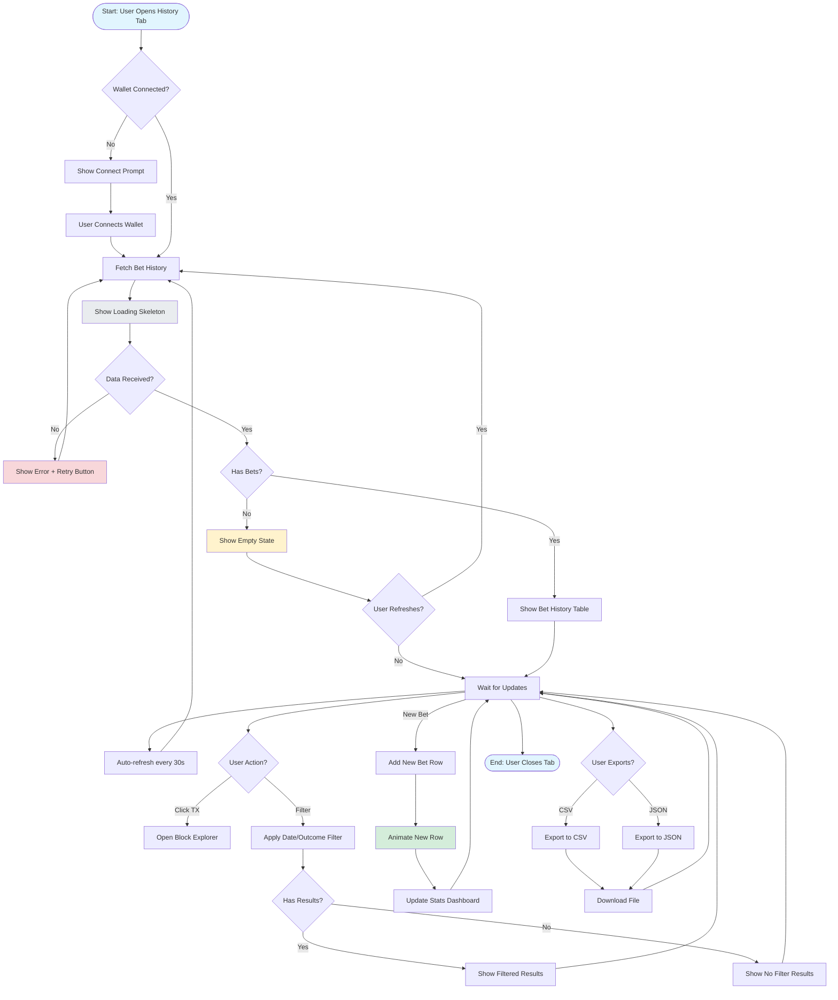

# Game History Interaction Flow

## Flow Overview

The game history flow enables users to review past bets, track performance, and access transaction details for transparency.

## Mermaid Flow Diagram



## Screen-by-Screen Wireframes

### Screen 1: Initial State (Empty)

```
┌─────────────────────────────────────────────────────────────┐
│  Games                    History  [Stats]  [Leaderboard]   │
├─────────────────────────────────────────────────────────────┤
│                                                             │
│  ┌─────────────────────────────────────────────────────┐   │
│  │  📊 Bet History                      [🔄 Refresh]   │   │
│  └─────────────────────────────────────────────────────┘   │
│                                                             │
│  ┌─────────────────────────────────────────────────────┐   │
│  │                                                     │   │
│  │              No bets yet.                           │   │
│  │                                                     │   │
│  │        Place your first flip to get started!        │   │
│  │                                                     │   │
│  │                                                     │   │
│  │              [  Start Playing  ]                    │   │
│  │                                                     │   │
│  └─────────────────────────────────────────────────────┘   │
│                                                             │
│  Showing: All Time    Filter: [▼ All]                      │
└─────────────────────────────────────────────────────────────┘
```

### Screen 2: Loading State

```
┌─────────────────────────────────────────────────────────────┐
│  Games                    History  [Stats]  [Leaderboard]   │
├─────────────────────────────────────────────────────────────┤
│                                                             │
│  ┌─────────────────────────────────────────────────────┐   │
│  │  📊 Bet History                      [🔄 Refresh]   │   │
│  └─────────────────────────────────────────────────────┘   │
│                                                             │
│  ┌─────────────────────────────────────────────────────┐   │
│  │ Date       | Choice | Amount  | Outcome | Payout    │   │
│  ├─────────────────────────────────────────────────────┤   │
│  │ ██████████  | █████  | ███████ | ███████ | ██████   │   │
│  │ ██████████  | █████  | ███████ | ███████ | ██████   │   │
│  │ ██████████  | █████  | ███████ | ███████ | ██████   │   │
│  │ ██████████  | █████  | ███████ | ███████ | ██████   │   │
│  │ ██████████  | █████  | ███████ | ███████ | ██████   │   │
│  └─────────────────────────────────────────────────────┘   │
│                                                             │
│  Showing: All Time    Filter: [▼ All]                      │
└─────────────────────────────────────────────────────────────┘
```

### Screen 3: With Data

```
┌─────────────────────────────────────────────────────────────┐
│  Games                    History  [Stats]  [Leaderboard]   │
├─────────────────────────────────────────────────────────────┤
│                                                             │
│  ┌─────────────────────────────────────────────────────┐   │
│  │  📊 Bet History         [Export ▼]  [🔄 Refresh]   │   │
│  └─────────────────────────────────────────────────────┘   │
│                                                             │
│  ┌─────────────────────────────────────────────────────┐   │
│  │ Date           | Choice | Amount  | Outcome | Payout│   │
│  ├─────────────────────────────────────────────────────┤   │
│  │ Mar 28, 01:15  | [Heads] | 1.0 ERG │ WIN  ✅ │ 0.97 │   │
│  │ Mar 28, 01:10  | [Tails] | 0.5 ERG │ LOSE ❌│ 0    │   │
│  │ Mar 28, 01:05  | [Heads] | 1.0 ERG │ WIN  ✅ │ 0.97 │   │
│  │ Mar 28, 00:55  | [Tails] | 0.1 ERG │ LOSE ❌│ 0    │   │
│  │ Mar 28, 00:50  | [Heads] | 5.0 ERG │ WIN  ✅ │ 4.85│   │
│  └─────────────────────────────────────────────────────┘   │
│  │                                               [↓ Load] │   │
│  └─────────────────────────────────────────────────────┘   │
│                                                             │
│  Showing: All Time    Filter: [▼ All]     [📊 View Stats]  │
└─────────────────────────────────────────────────────────────┘
```

### Screen 4: Filtered (Wins Only)

```
┌─────────────────────────────────────────────────────────────┐
│  Games                    History  [Stats]  [Leaderboard]   │
├─────────────────────────────────────────────────────────────┤
│                                                             │
│  ┌─────────────────────────────────────────────────────┐   │
│  │  📊 Bet History         [Export ▼]  [🔄 Refresh]   │   │
│  └─────────────────────────────────────────────────────┘   │
│                                                             │
│  ┌─────────────────────────────────────────────────────┐   │
│  │ Date           | Choice | Amount  | Outcome | Payout│   │
│  ├─────────────────────────────────────────────────────┤   │
│  │ Mar 28, 01:15  | [Heads] | 1.0 ERG │ WIN  ✅ │ 0.97 │   │
│  │ Mar 28, 01:05  | [Heads] | 1.0 ERG │ WIN  ✅ │ 0.97 │   │
│  │ Mar 28, 00:50  | [Heads] | 5.0 ERG │ WIN  ✅ │ 4.85│   │
│  └─────────────────────────────────────────────────────┘   │
│                                                             │
│  Showing: All Time    Filter: [▼ Wins]    [📊 View Stats]  │
└─────────────────────────────────────────────────────────────┤
│  Filtered: 3 wins shown (3 total)                           │
└─────────────────────────────────────────────────────────────┘
```

### Screen 5: Detail Modal (Row Clicked)

```
┌─────────────────────────────────────────────────────────────┐
│                                                           × │
│  ┌─────────────────────────────────────────────────────┐   │
│  │  Bet Details                                       │   │
│  ├─────────────────────────────────────────────────────┤   │
│  │                                                     │   │
│  │  Status:           ✅ Confirmed                     │   │
│  │  Date:             Mar 28, 2026 01:15:32 UTC        │   │
│  │  Game:             Coin Flip                       │   │
│  │  Bet ID:           a1b2c3d4-e5f6-7890-abcd-...      │   │
│  │                                                     │   │
│  │  ─────────────────────────────────────────────────  │   │
│  │                                                     │   │
│  │  Your Choice:      Heads                           │   │
│  │  Outcome:          Heads                           │   │
│  │  Result:           WIN ✅                          │   │
│  │                                                     │   │
│  │  ─────────────────────────────────────────────────  │   │
│  │                                                     │   │
│  │  Bet Amount:       1.000000000 ERG                  │   │
│  │  Payout:           0.970000000 ERG                  │   │
│  │  House Edge:       0.030000000 ERG                  │   │
│  │  Net:              -0.030000000 ERG                 │   │
│  │                                                     │   │
│  │  ─────────────────────────────────────────────────  │   │
│  │                                                     │   │
│  │  TX ID:            9f8e7d6c-5b4a-3210-fedc-...      │   │
│  │  Block Height:     1,234,567                        │   │
│  │  Confirmations:    12                               │   │
│  │                                                     │   │
│  │  [View on Explorer]  [Copy Details]                 │   │
│  │                                                     │   │
│  └─────────────────────────────────────────────────────┘   │
│                                                             │
│                      [  Close  ]                            │
└─────────────────────────────────────────────────────────────┘
```

### Screen 6: Date Range Filter

```
┌─────────────────────────────────────────────────────────────┐
│  Games                    History  [Stats]  [Leaderboard]   │
├─────────────────────────────────────────────────────────────┤
│                                                             │
│  ┌─────────────────────────────────────────────────────┐   │
│  │  📊 Bet History         [Export ▼]  [🔄 Refresh]   │   │
│  └─────────────────────────────────────────────────────┘   │
│                                                             │
│  ┌─────────────────────────────────────────────────────┐   │
│  │ Date Range:                                          │   │
│  │                                                      │   │
│  │  From: [Mar 27, 2026 📅]                             │   │
│  │  To:   [Mar 28, 2026 📅]                             │   │
│  │                                                      │   │
│  │  Presets: [Today] [Yesterday] [Last 7 Days] [All]   │   │
│  │                                                      │   │
│  │            [  Apply Filter  ]  [  Clear  ]             │   │
│  └─────────────────────────────────────────────────────┘   │
│                                                             │
│  ┌─────────────────────────────────────────────────────┐   │
│  │ Date           | Choice | Amount  | Outcome | Payout│   │
│  ├─────────────────────────────────────────────────────┤   │
│  │ Mar 28, 01:15  | [Heads] | 1.0 ERG │ WIN  ✅ │ 0.97 │   │
│  │ Mar 28, 01:10  | [Tails] | 0.5 ERG │ LOSE ❌│ 0    │   │
│  │ Mar 28, 01:05  | [Heads] | 1.0 ERG │ WIN  ✅ │ 0.97 │   │
│  └─────────────────────────────────────────────────────┘   │
│                                                             │
│  Showing: Mar 27 - Mar 28    Filter: [▼ All]               │
└─────────────────────────────────────────────────────────────┘
```

## Interaction States

### Table Row States

| State | Visual | Behavior |
|-------|--------|----------|
| Normal | White background, subtle borders | Hover highlight |
| Hovered | Light blue background | Show "View" cursor |
| Selected | Blue accent left border | Row clicked |
| New (animated) | Slide in from bottom + fade | Fade in animation |
| Pending | Yellow background | Show "⏳" status |
| Won | Green tint | Show "✅" |
| Lost | Red tint | Show "❌" |

### Badge States

| Type | Visual | Meaning |
|------|--------|---------|
| Heads | Blue badge | User chose heads |
| Tails | Purple badge | User chose tails |
| Win | Green badge with check | User won |
| Lose | Red badge with X | User lost |
| Pending | Yellow badge with spinner | Awaiting confirmation |

### Filter States

| Filter | Visual | Active State |
|--------|--------|--------------|
| All | Gray button | Default, no highlight |
| Wins | Green pill | Highlighted when active |
| Losses | Red pill | Highlighted when active |
| Pending | Yellow pill | Highlighted when active |

## Pagination & Loading

### Pagination Strategy
- Show 20 rows per page initially
- "Load More" button for infinite scroll
- Total count shown at bottom
- Jump to page for large histories

### Loading States
- Initial load: 5-row skeleton
- Refresh: Spinner overlay, not skeleton
- Load More: Spinner at bottom
- New bet arrival: Animate row insertion at top

## Filtering Options

### Outcome Filters
- All Bets
- Wins Only
- Losses Only
- Pending Bets

### Date Filters
- Today
- Yesterday
- Last 7 Days
- Last 30 Days
- Custom Range (date picker)

### Amount Filters
- Under 0.5 ERG
- 0.5 - 1 ERG
- 1 - 5 ERG
- Over 5 ERG

### Game Filters (Future)
- Coin Flip
- Dice
- Plinko
- Crash

## Export Options

### CSV Export
```
Date,Game,Choice,Outcome,Bet Amount,Payout,Net,TX ID,Block Height
2026-03-28T01:15:32Z,CoinFlip,Heads,Win,1.0,0.97,-0.03,a1b2...,1234567
2026-03-28T01:10:15Z,CoinFlip,Tails,Lose,0.5,0,-0.5,b2c3...,1234566
```

### JSON Export
```json
{
  "walletAddress": "0x7a3f...8d2e",
  "exportDate": "2026-03-28T01:20:00Z",
  "filters": {
    "outcome": "all",
    "dateRange": "all"
  },
  "bets": [
    {
      "betId": "a1b2c3d4-e5f6-7890-abcd-ef1234567890",
      "timestamp": "2026-03-28T01:15:32Z",
      "game": "coinflip",
      "choice": { "value": 0, "label": "Heads" },
      "outcome": "win",
      "betAmount": "1000000000",
      "payout": "970000000",
      "txId": "9f8e7d6c-5b4a-3210-fedc-ba9876543210",
      "blockHeight": 1234567,
      "confirmations": 12
    }
  ]
}
```

## Animation Specifications

### Row Insertion
```css
@keyframes slideIn {
  0% {
    opacity: 0;
    transform: translateY(-20px);
  }
  100% {
    opacity: 1;
    transform: translateY(0);
  }
}

.new-row {
  animation: slideIn 0.3s ease-out;
  background-color: #e6f7ff;
  transition: background-color 2s ease-out;
}
```

### Refresh Spinner
- Clockwise rotation
- 1 second per rotation
- Smooth infinite loop

### Loading Skeleton
- Gray background (#e0e0e0)
- Shimmer effect moving left to right
- 2-second cycle

## Performance Targets

| Metric | Target | Notes |
|--------|--------|-------|
| Initial load | < 1s | First 20 rows |
| Refresh | < 500ms | Update existing data |
| Filter apply | < 200ms | Instant filter |
| Export generation | < 2s | CSV/JSON file |
| New bet update | < 1s | Real-time update |
| Row animation | 300ms | Smooth insertion |

## Accessibility Considerations

### Keyboard Navigation
- Tab: Navigate table rows
- Enter: Open detail modal
- Escape: Close modal
- Arrow keys: Navigate pagination

### Screen Reader
- Proper table semantic HTML
- ARIA labels for icons
- Live region for new bet announcements

### Visual
- High contrast text
- Color + icon indicators
- Focus rings on table cells

## Edge Cases

### Scenario 1: Very Long History
```
User has 10,000+ bets
→ Show first 20, load more as needed
→ Server-side pagination for performance
→ Export all via CSV/JSON
```

### Scenario 2: Multiple Pending Bets
```
User has 5 pending bets
→ Show pending status prominently
→ Auto-refresh every 10s for pending
→ Group pending section at top
```

### Scenario 3: Rapid New Bets
```
User places 5 bets in 30 seconds
→ Each new bet animates in at top
→ Show "X new bets" notification
→ Allow pause auto-refresh
```

### Scenario 4: TX Replaced
```
Bet TX was replaced (RBF)
→ Show warning in history
→ Link to new TX ID
→ Note: "Original TX: [link]"
```

## Component Specifications

### GameHistory Component Props

```typescript
interface GameHistoryProps {
  walletAddress: string;
  autoRefresh?: boolean;
  refreshInterval?: number; // milliseconds
  onBetClick?: (betId: string) => void;
  maxRows?: number;
  showExport?: boolean;
}

interface BetRecord {
  betId: string;
  timestamp: string; // ISO 8601
  game: string;
  choice: { value: number; label: string };
  outcome: 'win' | 'lose' | 'pending';
  betAmount: string; // nanoERG
  payout?: string; // nanoERG
  txId: string;
  blockHeight?: number;
  confirmations?: number;
}
```

### Filter Options Type

```typescript
interface HistoryFilters {
  outcome?: 'all' | 'win' | 'lose' | 'pending';
  dateRange?: {
    from: Date;
    to: Date;
  };
  game?: string[];
  minAmount?: bigint;
  maxAmount?: bigint;
}
```

## Real-time Updates

### WebSocket Events (Future Enhancement)
```typescript
// New bet placed
{ type: 'bet:new', bet: BetRecord }

// Bet confirmed
{ type: 'bet:confirmed', betId: string, blockHeight: number }

// Bet outcome
{ type: 'bet:outcome', betId: string, outcome: 'win' | 'lose', payout: string }
```

### Polling Strategy
- Connected: Poll every 30s
- Has pending: Poll every 10s
- Idle (no bets for 1h): Poll every 2m
- Paused (user manually): No polling

## Next Steps

1. [ ] UI Developer Jr implements GameHistory component
2. [ ] Component Developer Jr builds filter modal
3. [ ] Backend adds pagination support
4. [ ] QA tests with large history sets
5. [ ] Add analytics for filter usage patterns
6. [ ] Consider WebSocket for real-time updates

---

**Related Components**:
- `frontend/src/components/GameHistory.tsx` (existing)
- `frontend/src/components/StatsDashboard.tsx`
- `frontend/src/components/ui/Table.tsx` (potential)

**Related Issues**:
- MAT-15: Tokenized bankroll and liquidity pool
- MAT-17: Plinko and crash games (multi-game history)
